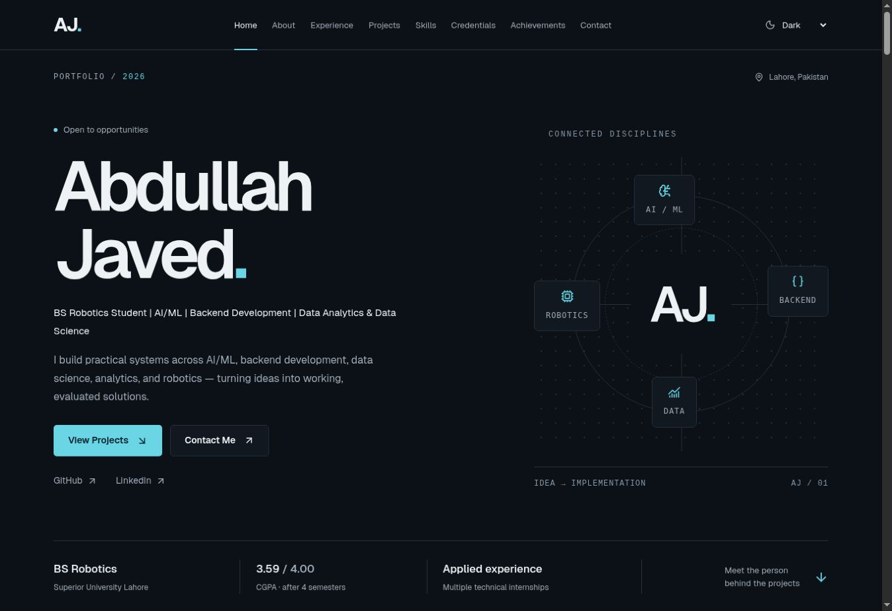

# Abdullah Javed — Portfolio

Abdullah’s professional technical portfolio across AI/ML, backend development, data science, analytics, and robotics. Built with Next.js App Router, TypeScript, React, Tailwind CSS, and Lucide React.

**Live portfolio:** [abdullah-javed-portfolio-gamma.vercel.app](https://abdullah-javed-portfolio-gamma.vercel.app/)



The approved AJ navy/cyan design includes **10 Featured Projects** and a compact **14-project archive**. One category filter controls both groups. Project dialogs provide the technical approach, evaluation context, available repository links, and real visuals. Fifteen projects include repository screenshots or result graphics; others use category graphics.

[View the compact Project Archive](docs/portfolio-archive.jpg).

## Local setup

Use Node.js 20.9 or later, as specified in `package.json`. Open this folder in VS Code and run:

```bash
npm install
npm run dev
```

Open the local address printed in the terminal. Stop the server with Ctrl+C.

```bash
npm run check   # ESLint and TypeScript
npm run build   # Production build
npm start       # Serve the completed build locally
```

The small development wrapper accepts `--host` and `--port` for compatible preview environments. Exact package versions and the lockfile are included.

## Architecture and content

The home page is prerendered. Client components handle navigation, filters, native project dialogs, and persistent system/light/dark themes. No database, CMS, authentication, or contact-form backend is needed.

| Path | Purpose |
| --- | --- |
| `app/` | Home route, layout, SEO, sitemap, robots, 404, and theme styles |
| `components/` | Reusable page sections, navigation, project cards/archive/dialogs, and theme selector |
| `data/portfolio.ts` | Typed personal facts, experience, unified projects, skills, credentials, recognition, and awards |
| `lib/site-config.ts` | Production origin and actual resume-file check |
| `public/projects/` | Genuine project screenshots and evaluation graphics |
| `public/fonts/` | Local Geist font and its SIL Open Font License |
| `docs/LOCAL-UPDATE-GUIDE.md` | Practical instructions for routine VS Code maintenance |
| `docs/PROJECT-AUDIT.md` | Repository-by-repository verification and content decisions |
| `docs/project-evidence.json` | Inspected source paths and Git blob/tree identifiers |
| `docs/asset-sources.json` | Provenance for included project visuals |
| `docs/review-notes.md` | Validation results, missing assets, and review limits |
| `scripts/` | Development entry point and standalone review generator |

Edit `data/portfolio.ts` for routine updates. Add each project once to `projects`: `featured: true` places it in the main grid, and `featured: false` places it in the archive. `spotlight: true` enlarges a featured card, as used for the first two projects. Categories can overlap; counts update automatically. Current-role cards derive from experience entries with `current: true`.

`demo` is optional and only produces a **Live Demo** link when populated. No verified deployed application URL was found during this audit, so no demo buttons are currently shown. Projects without repositories have no GitHub button. Preserve the scope of reported metrics; consult the audit before changing them.

## Images, THOR, and resume

Add a real image to `public/projects/`, then set the project’s `image` fields (`src`, descriptive `alt`, optional `source`) and record its provenance. Next.js Image reserves the visual area, lazy loads images, and switches to the category graphic if loading fails. Archive images appear in Explore dialogs.

THOR accepts the same `image` plus an optional `video` object with `src`, `caption`, and optional `poster`. Its dialog then displays a controlled video player. The [local update guide](docs/LOCAL-UPDATE-GUIDE.md) includes exact examples.

To enable the resume, add `public/Abdullah-Javed-Resume.pdf`, set `portfolio.resume.enabled` to `true`, and rebuild. Both the real file and flag are required. It remains disabled in this package. Credential verification URLs are also optional and currently omitted.

## Review without publishing

After building:

```bash
npm run preview:file
```

Open `preview/abdullah-javed-portfolio.html` in a browser. It bundles the same React components, production CSS, local font, and project images. Navigation, both project groups, filters, dialogs, and themes work offline; external links require internet. The review artifact omits the resume link and does not embed future video files. Test those additions on the local Next.js server.

The generated preview is ignored by Git. It is a review artifact; the Next.js project is the source for future deployment.

## GitHub and Vercel

The approved portfolio has its own [GitHub repository](https://github.com/Abdullah-Javed-01/abdullah-javed-portfolio). Existing project repositories were inspected read-only and remain unchanged.

The portfolio is deployed to production in the Vercel project `abdullah-javed-portfolio`, under `workabdullahaj-9596`. The initial production build completed successfully on September 13, 2026, using the approved source from commit `642398e`. Build settings are **Next.js**, `npm ci`, and `npm run build`; no backend setup is required.

**Automatic Git deployments are connected.** Vercel’s GitHub app is installed for **only `Abdullah-Javed-01/abdullah-javed-portfolio`**, and this repository is connected to the existing Vercel project. The production environment tracks `main`: push an update to that branch, wait for Vercel to show **Ready**, then check the live site. Other branches use preview deployments. See the [local update guide](docs/LOCAL-UPDATE-GUIDE.md).

Vercel’s `VERCEL_PROJECT_PRODUCTION_URL` supplies the confirmed production origin for the canonical URL and sitemap. The live site is indexable; unconfigured local reviews and Vercel preview environments remain `noindex`. Set `NEXT_PUBLIC_SITE_URL` only if you later configure a different production domain.

Semantic sections, visible keyboard focus, native modal behavior, Escape dismissal, reduced-motion styles, descriptive image alt text, and a skip link are preserved. See [review notes](docs/review-notes.md) for the actual browser checks and practical limits.
